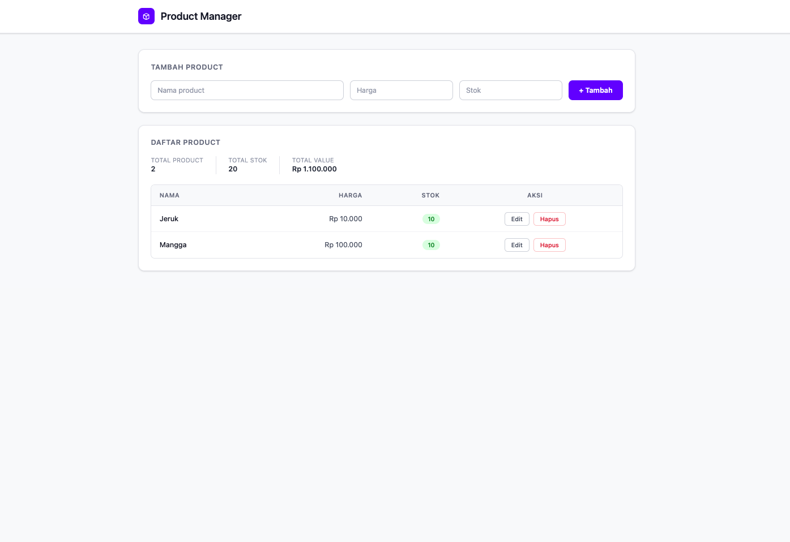

# Learn Basic Zustand



**Live demo:** https://learn-react-ts-zustand.vercel.app/

I built this project to learn **Zustand** — a state management library for React that is far simpler than Redux. Instead of just reading the docs, I built something real: a simple product CRUD app.

## What's covered here

- How to build a proper Zustand store, not just slapping `create()` and calling it done
- Why selectors matter (to prevent unnecessary component re-renders)
- Using `persist` so data survives a page refresh
- Using `devtools` to debug state in the browser
- A sensible folder structure for feature-based architecture

## Tech stack

| | |
|---|---|
| **React 19** | UI framework |
| **Zustand 5** | State management |
| **React Router 7** | Routing |
| **Tailwind CSS 4** | Styling |
| **TypeScript** | To avoid mistyping field names |
| **Vite** | Dev server & bundler |

## Project structure

```
src/
├── features/
│   └── products/
│       ├── components/     # UI: form, list, row, error banner
│       ├── store/
│       │   ├── productStore.ts      # Main store + actions
│       │   └── productSelectors.ts  # Custom hooks per use case
│       ├── types.ts        # Type definitions
│       └── utils.ts        # Small helpers (generate ID, etc.)
├── router/
│   └── index.tsx           # Route definitions
└── main.tsx
```

Why separate store and selectors? So components just call `useProducts()` or `useTotalValue()` — they don't need to know how to read from the store. If the store structure changes, only the selectors need updating, not every component.

## How to run

```bash
npm install
npm run dev
```

Open `http://localhost:5173` and you can immediately add, edit, and delete products. Data is saved in localStorage so it persists across refreshes.

## What's interesting about Zustand

Compare this:

```ts
// Redux — lots of boilerplate
dispatch(setProducts(data))
dispatch(setError(null))
dispatch(setLoading(false))

// Zustand — just do it
set({ products: data, error: null, loading: false })
```

I also use `useShallow` for selectors that return objects, so they don't trigger re-renders every time unrelated state changes:

```ts
export const useProductActions = () =>
  useProductStore(
    useShallow((s) => ({
      createProduct: s.createProduct,
      updateProduct: s.updateProduct,
      deleteProduct: s.deleteProduct,
    }))
  );
```

## App features

- Add a product (name, price, stock)
- Inline editing directly in the table row
- Delete with confirmation
- Input validation (empty name, negative price/stock, stock must be an integer)
- Color-coded stock badge: red if out of stock, yellow if low, green if healthy
- Summary stats: total products, total stock, total value
- Data persisted in localStorage
